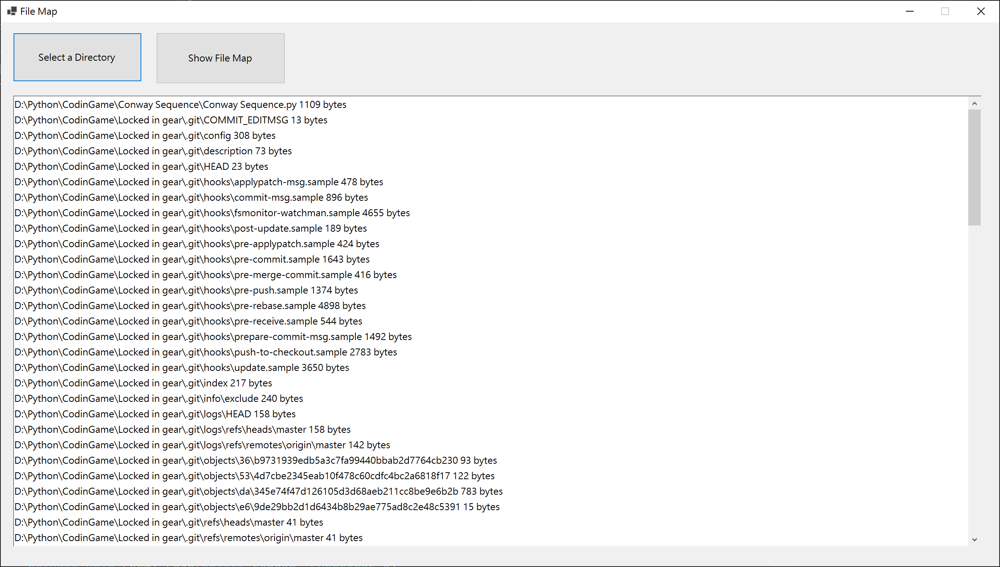
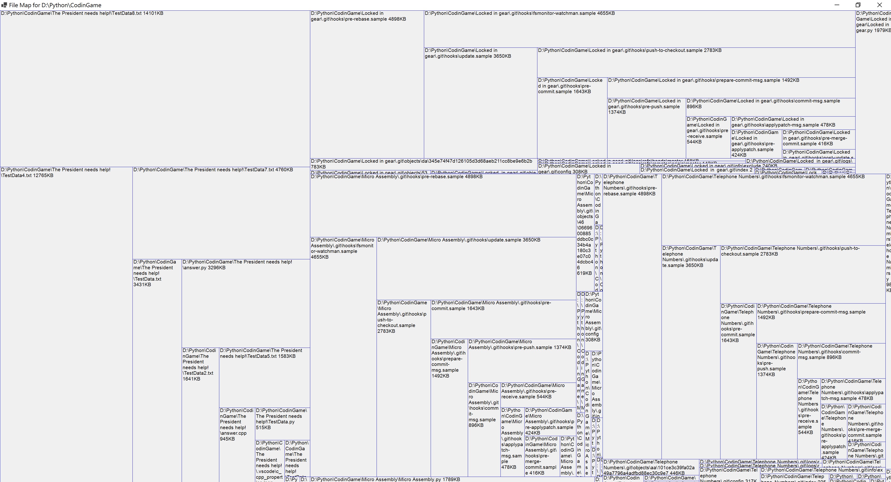

# File Map

A tool that helps to quickly ascertain the sizes of files within a directory, by visualizing directories and files as a diagram.This way, it facilitates easy discernment of file numbers and sizes.  

